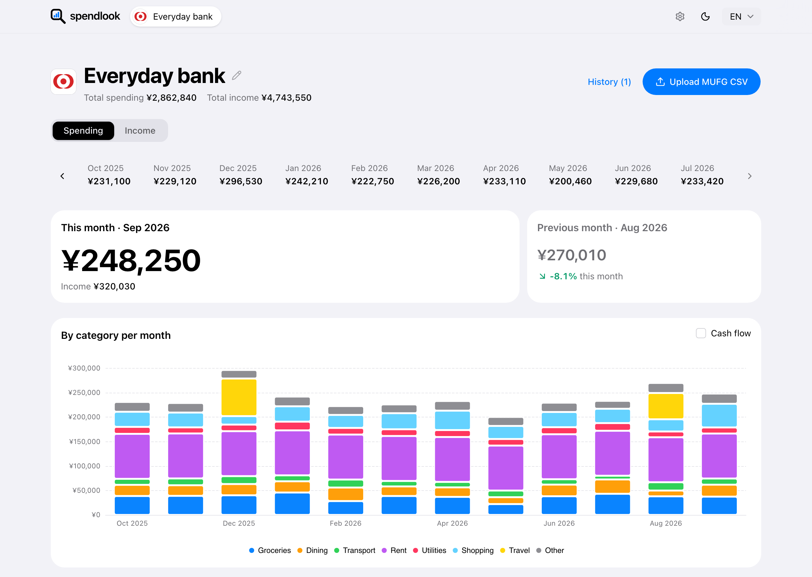
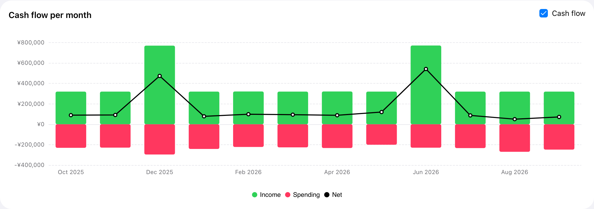

# spendlook

Browser-only spending dashboard for bank and e-wallet CSV exports. Live at **https://spendlook.app**.

<picture>
  <source media="(prefers-color-scheme: dark)" srcset="docs/screenshots/dashboard-dark.png">
  
</picture>

- **Private by design** – no server, no account. Data stays in your browser (IndexedDB), with optional encryption and backup export.
- **Imports** – MUFG and PayPay built in; other CSVs (Shift_JIS, GBK, Big5, EUC-KR, …) via column mapping.
- **AI categorization** – bring your own Anthropic, Gemini or OpenAI key. Only merchant names are sent.
- **Languages** – English, 日本語, 中文.
- **Cash flow** – income against spending per month, with the net for each month.

<picture>
  <source media="(prefers-color-scheme: dark)" srcset="docs/screenshots/cash-flow-dark.png">
  
</picture>

## Develop

    bun install
    bun run dev       # local
    bun run test      # unit tests
    bun run i18n      # extract messages → src/locales/*.po
    bun run screenshots  # sample data → docs/screenshots (README) + src/assets/screenshots (landing); needs ImageMagick
    bun run deploy    # build + wrangler deploy (Cloudflare static assets)

## Security

See [SECURITY.md](SECURITY.md). Please report vulnerabilities by email, not public issues.

## License

[MIT](LICENSE)
